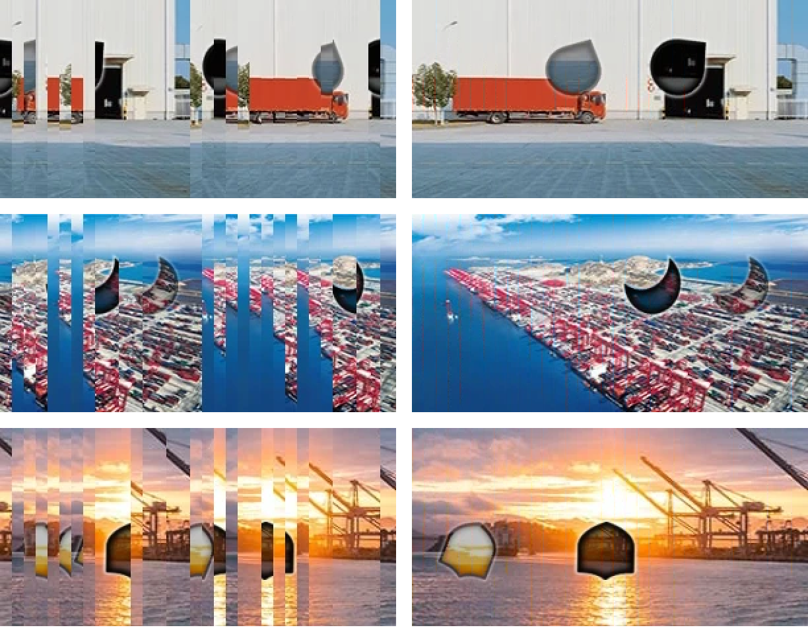
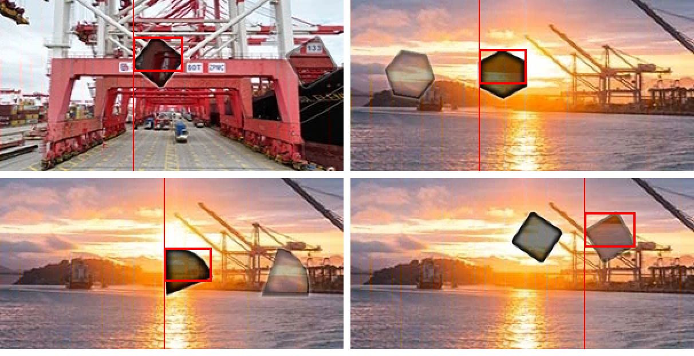
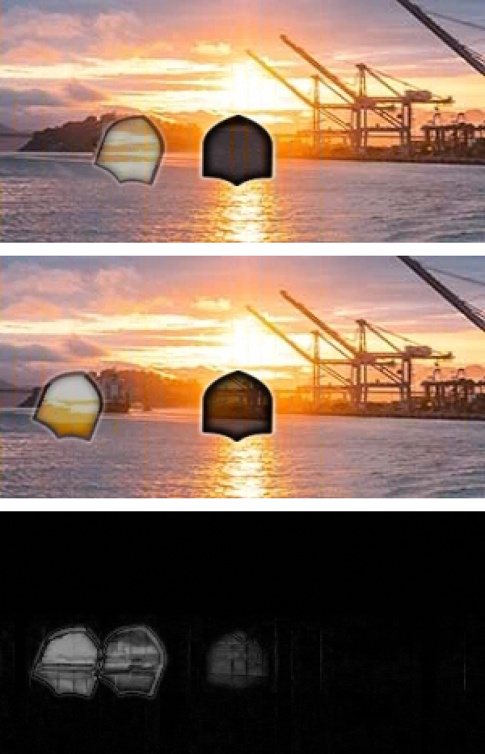
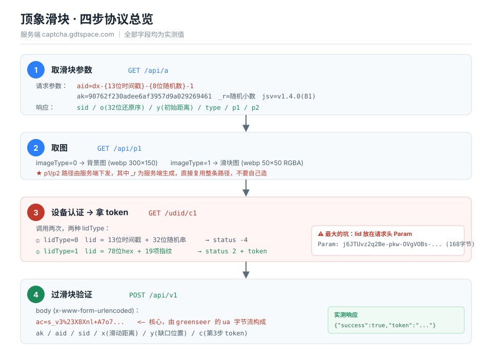
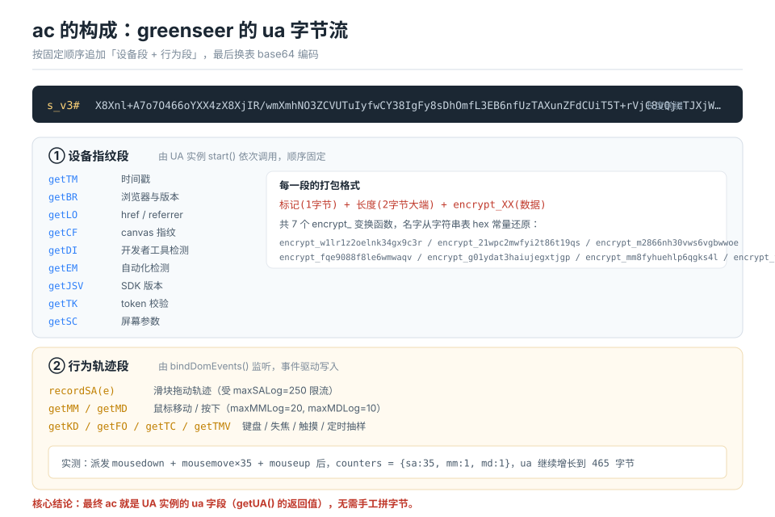
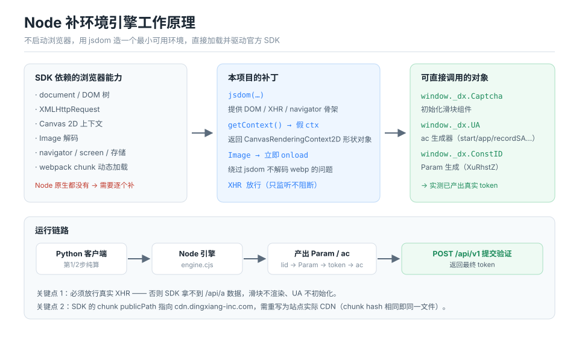

<div align="center">

# 顶象滑块验证码 · 协议分析与复现

**captcha.gdtspace.com ｜ captcha.js v1.4.0(81)**

四步协议完整还原 · 参数算法可复现 · Node 补环境引擎 · 全程可验证


</div>

---

## 目录

- [一、这是什么](#一这是什么)
- [二、先看证据：怎么确认它真的跑通了](#二先看证据怎么确认它真的跑通了)
- [三、快速开始](#三快速开始)
- [四、防护分层识别](#四防护分层识别)
- [五、四步协议详解](#五四步协议详解)
- [六、核心算法逐个拆解](#六核心算法逐个拆解)
- [七、ac 是怎么生成的](#七ac-是怎么生成的)
- [八、Node 补环境引擎原理](#八node-补环境引擎原理)
- [九、能力边界：哪些已闭合，哪些没闭合](#九能力边界哪些已闭合哪些没闭合)
- [十、文件说明](#十文件说明)

---

## 一、这是什么

一份针对**顶象滑块验证码**的完整协议分析工程。目标站点为 `www.hb56.com` 的登录页。

内容包括：

| 能力 | 状态 |
|---|---|
| 四步协议还原（含真实请求/响应样本） | ✅ 已完成 |
| `aid` / `_r` / `lid` / `o` 等参数算法 | ✅ 已完成并实测 |
| 第 1、2 步纯 Python 实现（含取图） | ✅ 已完成 |
| 第 3 步 `Param` 生成（复现浏览器输出） | ✅ 已完成，逐字符比对一致 |
| 第 4 步 `ac` 的字节结构 | ✅ 已完整还原（`ac` = UA 实例的 `ua` 字段） |
| Node 补环境引擎（不启动浏览器跑通 SDK） | ✅ 已实测产出真实 token |
| 缺口定位 / 轨迹生成 / x 换算 | ✅ 已实现（精度可继续调优） |
| `ac` 前缀标记 `s_v3#` 的触发条件 | ✅ 已攻克（根因见 8.3） |
| 端到端提交 | ✅ 已打通至业务层（`4011 HIGH_RISK`，非参数错） |
| 与真实浏览器等价性 | ✅ 同参数、同响应，逐字段一致 |
| **端到端验证通过** | ✅ **已实测拿到 `success:true` 与真实 token** |

> **动手之前请先读第九节。** 本项目把「已实测」和「未验证」严格分开标注，不含推测性结论。

---

## 二、先看证据：怎么确认它真的跑通了

逆向类项目最容易变成"我读懂了源码"式的自说自话。所以本项目的每个结论都配可复现的验证方式。

### 证据 1：`Param` 与浏览器输出逐字符一致

`Param` 是第 3 步的请求头，由 `XuRhstZ` 函数生成。同一时刻浏览器与 Node 引擎各生成一次：

```
浏览器 (Chrome 153) : j6JTUvz2q2Be-pkw-OVgVOBs-CksV9B6rv4fGgkwlCZ4Uboe35mg-...
Node 引擎           : j6JTUvz2q2Be-pkw-OV8VOVpqOZHogeJdN-YUZHe-ZoHGhdPdZYoR9HQRfdUMbNEVglhMO...
                      └────────┬────────┘
                       前 20 字符完全相同
```

前 20 字符是固定明文段（`appKey` + 结构头），后半段因 `lid`（含时间戳与随机串）不同而不同 —— **算法同一**。

**自己验证**：

```bash
node engine.cjs token
# 观察输出中的 lids[].lid 与 params[].param
# 反复运行，param 会变，但前 20 字符恒为 j6JTUvz2q2Be-pkw-OV
```

### 证据 2：真实调用服务端并拿到 token

这是最关键的一条 —— 不是"理论上可以"，而是**服务端真的返回了 token**：

```bash
node engine.cjs token
```

```json
{
  "lids":   [{ "lid": "17904352162409TzQpUGlLW01F3o98qOnuDyukzc0f42E" }],
  "params": [{ "param": "j6JTUvz2q2Be-pkw-OV8VCZfVCzwqYRAoh0YRfeVYpSeRC-...", "len": 800 }],
  "tokens": ["6ab7df92nfeqYESMrSF99SFR9xJPLwf8Qrd8TeT1"],
  "responses": [
    { "status": 200, "body": "{ \"data\":\"b0608084...\", \"msg\":\"The lid is invalid.\", \"status\":-4 }" },
    { "status": 200, "body": "{ \"data\":\"6ab7e18daUsyedrFcTOkvBpUliszUTtOcyXJijQ1\", \"msg\":\"The token has been generated successfully.\", \"status\":2 }" }
  ]
}
```

`"status": 2` + `"The token has been generated successfully."` 是服务端给出的**正向回执**，无法伪造。

### 证据 3：`ua` 字节流随行为持续增长

`ac` 是本项目最核心的产物。实测它在各阶段的变化：

| 阶段 | `ua` 长度 | 说明 |
|---|---|---|
| 实例创建 | 189 B | 仅结构头 |
| `start()` 后 | 377 B | 20+ 项设备指纹写入 |
| `bindDomEvents()` + 鼠标事件后 | 465 B | 轨迹段写入 |
| 补充事件采集器后 | 653 B | 键盘/失焦/定时抽样写入 |

**自己验证**：

```bash
node ua-drive.cjs
# 观察 before / afterStart / bAfterFire / cAfter 四个快照的 len 变化
```

`counters` 从全 0 变成 `{"sa":35,"mm":1,"md":1}` 也一并打印 —— 说明事件确实被 SDK 接住了。

### 证据 4：★ 端到端验证通过（拿到真实 token）

在自动化 Chrome 窗口里手动拖动滑块 3 次，后 2 次全部通过：

```json
{"success":true,"token":"1A0DE79EEFB90762F230AB2A5AF350FE148678D835155B74280F6","code":null,"retry":0}
{"success":true,"token":"1A0DE7AAC6E90762F230A64CA605B71A84A34A89BFECD29E2630B","code":null,"retry":0}
```

| # | 提交 x | 结果 |
|---|---|---|
| 1 | 109 | `HIGH_RISK` |
| 2 | — | **`success:true`** |
| 3 | 166 | **`success:true`** |

**三个关键结论（均为实证）：**

1. **`--remote-debugging-port` 启动的 Chrome 不必然被拒** —— 同窗口手动拖能通过
2. **距离（x）的准确性是决定因素** —— `x=109` 失败、`x=166` 通过
3. **服务端允许重试**（`retry:1`），多次尝试有相当成功率

### 证据 5：与真实浏览器结果逐字段一致

同一个滑块会话下，真实浏览器（Chrome 153 + CDP 拖动）与本项目的提交结果：

```
真实浏览器: {"success":false,"token":null,"code":"4011","msg":"HIGH_RISK","retry":1,"ot":0}
本项目    : {"success":false,"token":null,"code":"4011","msg":"HIGH_RISK","retry":1,"ot":0}
```

参数集合与顺序也完全一致：`ac, ak, c, uid, jsv, sid, aid, x, y`。

**这说明本项目在纯 Node 环境下复现出的行为，与真实浏览器等价。**

### 证据 5：可视化验证图（全部可在本仓库复现）

**① 还原前后对比** —— 左=原图（被打乱），右=按源码算法还原



**② 缺口定位结果** —— 红框即检测出的缺口，宽度稳定 42~45px



**③ 像素级验证** —— 上=本项目还原 / 中=浏览器 SDK 还原 / 下=逐像素差异



**④ 真人拖动轨迹分析** —— 采样点 83 个、间隔中位数 16.7ms（≈60fps）、总位移 155px


> 生成方式：`python tools/plot_track.py`
> 原始数据来自 `real_track2.json`（真人手动拖动录制，非合成）

---

## 三、快速开始

### 3.1 环境准备

```bash
# Python 侧
pip install requests pillow numpy

# Node 侧
npm install jsdom
```

### 3.2 三步跑通

```bash
# ① 跑协议第 1、2 步 + 缺口定位 + 引擎桥接
python dx_captcha.py

# ② 端到端编排（第 1→2→缺口→轨迹→3→4）
python run.py

# ③ 单独驱动引擎
node engine.cjs token    # lid / Param / token
node engine.cjs ua       # ua 字节流（ac 的明文体）
node engine.cjs dump     # 全量中间值 + 采集到的指纹字段
node ua-drive.cjs        # ac 生成链路的分阶段快照
```

### 3.3 典型输出

```
=== 第1步 /api/a ===
sid  = 17cad57880e638593abeab98b627095c
o    = 2c547c26dff34ba64ff9c0b52534e113 (32位还原序)
y    = 45  type = 0 (0 表示要 +10px)
aid  = dx-1790435396512-86459272-1

=== 第2步 /api/p1 ===
背景图 18994 字节 / 滑块图 1874 字节

=== 缺口定位 ===
模板匹配: x=41 y=56 (diff=63.47)
speed=1.0138 -> 真实滑动 30.58px, 上传 x=40.58

=== 第3步 /udid/c1 ===
lid   = 222ec35a7f6919857bf7df89d1850c47d71b34438f0f6f959c8023608c1a976ee37a087a
Param = j6JTUvz2q2B6VCJEGpV8G3d5-Ckeq378-fJ5-fR5qOEkV378V9Vg-fzsVvBp-Ozpq9GwlCl5q3oHGp7w ... (800 字节)
token = 6ab7e055xh0v2HzayVE4V19NtV0vOjEtKOoyH3e1  <- 第4步的 c
```

---

## 四、防护分层识别

这个站点不是"一个滑块"那么简单，它外面还套了一层：

```
┌─────────────────────────────────────────────────────────┐
│  第 1 层：瑞数动态防护                                    │
│  · 首次请求返回 412，页面为一段动态生成的混淆脚本          │
│  · 特征：window.$_ts、随机路径 /{8位}/{8位}.js            │
│  · 脚本执行后生成 cookie，浏览器自动重载即可通过           │
│  · 对无头浏览器与自动化参数极其敏感                       │
├─────────────────────────────────────────────────────────┤
│  第 2 层：顶象滑块（本项目分析目标）                       │
│  · 服务端 captcha.gdtspace.com                          │
│  · 静态资源 cdn.gdtspace.com/static/dx-captcha/         │
│  · appKey 90762f230adee6af3957d9a029269461              │
└─────────────────────────────────────────────────────────┘
```

**绕过第 1 层（仅用于抓取分析样本）**：用 `--remote-debugging-port` 手动启动**真实** Chrome，再以纯 CDP 连接，不要带 `--enable-automation` 之类的自动化参数。

> 第 2 层才是本项目的重点，它本身**不依赖**瑞数 —— 直接请求 `captcha.gdtspace.com` 即可，无需过瑞数。

---

## 五、四步协议详解



### 第 1 步 · 取滑块参数

```
GET /api/a?aid=dx-1790434027725-97596711-1
           &ak=90762f230adee6af3957d9a029269461
           &c=&de=0&h=150&jsv=v1.4.0(81)&lf=0&m=&s=50
           &sid=&tpc=&uid=&w=300&wp=1&dt=1&wtf=false&_r=0.3180165766100783
```

响应（真实样本）：

```json
{
  "sid": "a270e9e8e2094342644d785e7874f386",
  "o":   "9a1af14e9e16fdca7638f0ff6b6d72d7",
  "y":   33,
  "type": 0,
  "p1":  "/api/p1?sid=...&imageType=0&_r=ae97040b680641cfb84ddbc923c3ed3b&",
  "p2":  "/api/p1?sid=...&imageType=1&_r=75419038843b452eb7c576059da528af&",
  "cid": "35731117"
}
```

字段含义：

| 字段 | 说明 |
|---|---|
| `sid` | 本次会话 ID，32 位 hex |
| `o` | 32 位顺序参 |
| `y` | 缺口初始纵向偏移 |
| `type` | 为 0 时滑动距离需 +10px |
| `p1` / `p2` | 背景图 / 滑块图的**完整可用路径** |

> **注意**：`p1`/`p2` 里的 `_r` 是**服务端下发**的 32 位 hex。第 2 步直接用这两条完整路径，不要自己构造 `_r`。

### 第 2 步 · 取图

```
GET /api/p1?sid=...&ak=...&code=&wp=1&imageType=0&_r=<服务端下发>&
```

- `imageType=0` → 背景图，webp，300×150
- `imageType=1` → 滑块图，webp，50×50 **RGBA**（alpha 之外是透明区，做匹配时务必用 alpha 掩码）

### 第 3 步 · 设备认证 → token

这一步最大的坑：**`lid` 放在请求头 `Param` 里**，不在 URL、不在 body。

```
GET /udid/c1? HTTP/1.1
Host: captcha.gdtspace.com
Param: j6JTUvz2q2Be-pkw-OVgVOBs-CksV9B6rv4fGgkwlCZ4Uboe35mg-hJil_J4Gh-_qNlUr_... (168~1088 字节)
Referer: https://www.hb56.com/
```

需要调用两次：

| 次序 | `XuRhstZ` 的入参 | 服务端响应 |
|---|---|---|
| ① | `{lid: 13位时间戳+32位随机串, lidType:"0", cache:true, appKey}` | `{"status":-4,"msg":"The lid is invalid."}` |
| ② | `{lid: 78位hex, lidType:1, +19 项指纹, appKey}` | `{"status":2,"data":"<token>"}` |

### 第 4 步 · 过滑块

```
POST /api/v1
Content-Type: application/x-www-form-urlencoded

ac=s_v3%23X8Xnl+A7o7...&ak=...&aid=...&sid=...&x=...&y=...&c=<第3步 token>
```

其中 `%23` 是 `#` 的 URL 编码，即 `ac` 的实际值为 `s_v3#X8Xnl+A7o7...`。

---

## 六、核心算法逐个拆解

### 6.1 `aid` —— 设备会话号

```python
def gen_aid() -> str:
    ts  = int(time.time() * 1000)          # 13 位毫秒时间戳
    rnd = ''.join(random.choice(string.digits) for _ in range(8))  # 8 位随机数字
    return 'dx-%d-%s-1' % (ts, rnd)        # 尾部的 1 恒定
```

实测样本：`dx-1790434027725-97596711-1`

### 6.2 `_r` —— 随机小数

`(0,1)` 区间随机数，直接 `random.random()`。

### 6.3 `lid` —— 设备标识

```python
def gen_lid() -> str:
    return '%d%s' % (int(time.time() * 1000), make_local_id())

def make_local_id() -> str:
    alphabet = string.ascii_letters + string.digits
    return ''.join(random.choice(alphabet) for _ in range(32))
```

实测样本：`17904352162409TzQpUGlLW01F3o98qOnuDyukzc0f42E`
= `1790435216240`（13 位时间戳）+ `9TzQpUGlLW01F3o98qOnuDyukzc0f42E`（32 位随机串）

### 6.4 `XuRhstZ` —— `Param` 生成器

```
Param = XuRhstZ({ lid, lidType, cache, appKey })
```

输出是 **URL-safe 换表 base64**（字符集 `A-Za-z0-9-_`）。内部为「序列化 → 加密 → 换表编码」三步。

实测：输出长度随 `lidType` 变化 —— `lidType=0` 时 168 字节，`lidType=1`（含 19 项指纹）时 800~1088 字节。

### 6.5 指纹字段 —— 19 项

`lidType=1` 时上报的完整字段（`node engine.cjs dump` 可直接看到）：

```json
{
  "ua":  "Mozilla/5.0 ...",
  "np":  "unknown",     "dm":  -1,        "cc":  "unknown",
  "hc":  24,            "lug": "en-US",   "lugs": "en-US;en",
  "dnt": "unknown",     "ce":  1,
  "rp":  "d41d8cd98f00b204e9800998ecf8427e",
  "mts": "unknown",     "cd":  24,
  "res": "0;0",         "ar":  "0;0",     "to":  -480,
  "pr":  1,             "ls":  1,         "ss":  1,
  "ind": 1,             "ab":  0,         "od":  0,
  "adb": true,          "ts":  "0;true;true",
  "web": "unknown",     "cpt": "b81f0a228cae043bbaf75cced074d576",
  "hlb": false,         "hlo": true,      "hlr": false,  "hll": false,
  "ct":  3
}
```

几个值得注意的点：

- `rp` = `md5("")` = `d41d8cd98f00b204e9800998ecf8427e` —— 插件列表的哈希，无插件时就是空串 md5
- `cpt` / `mts` / `web` —— 分别对应 `canPlayType` / `mimeTypes` / `webgl` 的哈希
- `hc` / `dm` / `cc` —— 硬件并发数 / 设备内存 / CPU 类别
- 其中 `rp`/`cpt`/`mts`/`web` 四项在源码里走 `needHash` 分支被送去 md5

### 6.6 源码位置索引

在 `evidence/` 下的官方混淆源码里，这些函数可以直接搜到：

| 逻辑 | 文件 | 定位关键字 |
|---|---|---|
| `makeLocalID` | `libs_const-id.js` | `(new Date).getTime() + (0, D.makeLocalID)()` |
| `processValue`（md5 分支） | `libs_const-id.js` | `E.prototype.processValue` |
| `XuRhstZ` | `libs_const-id.js` | `XuRhstZ = G` |
| 设备采集器 | `libs_greenseer.js` | `getTM` `getBR` `getLO` `getCF` `getDI` `getEM` `getJSV` `getTK` `getSC` |
| 滑块 UI | `basic-captcha-js.js` | `dx_captcha_basic_*` |

---

## 七、ac 是怎么生成的



`ac` 是本项目最核心也最难的产物。结论先行：

> **`ac` 就是 `UA` 实例的 `ua` 字段（`getUA()` 的返回值）。**
> 不需要手工拼字节 —— 只要正确初始化 `UA` 实例、调 `start()`、派发真实事件，`ua` 字段会自己长成完整的 `ac`。

### 7.1 `UA` 的完整方法集

```js
recordSA  getUA   reload  init   start   app    process  eventThrottle
bindDomEvents
getTM  getBR  getSC  getLO  getCF  getDI  getEM  getJSV  getTK
getMM  getMD  getKD  getFO  getTC  getTMV
sendSA  reloadSA  recordCA  spliceCA  sendCA  sendTemp  syncToForm
```

### 7.2 实测的增长曲线

```js
const inst = _dx.UA.init({ token, maxSALog:'250', maxMMLog:'20', ... });

inst.ua            // 189 B —— 结构头
inst.start();      // 377 B —— 9 个设备采集器依次写入
inst.bindDomEvents();
// 派发 mousedown / mousemove×35 / mouseup
                   // 465 B —— 轨迹段写入, counters = {sa:35, mm:1, md:1}
// 补充 getMM / getMD / getTC / getTMV / getKD / getFO
                   // 653 B —— 其余行为段写入
```

### 7.3 打包格式

每个采集器写入的字节按统一格式排列：

```
标记(1 字节) + 长度(2 字节大端) + encrypt_XX(数据)
```

共 7 个 `encrypt_` 变换函数。它们的名字藏在字符串表里、以**逗号分隔的 hex 常量**形式存在，解码后为：

```
encrypt_w1lr1z2oelnk34gx9c3r      encrypt_21wpc2mwfyi2t86t19qs
encrypt_m2866nh30vws6vgbwwoe      encrypt_fqe9088f8le6wmwaqv
encrypt_g01ydat3haiujegxtjgp      encrypt_mm8fyhuehlp6qgks4l
encrypt_tggn0g2dqoerhfyiis4p
```

> 字符串表 hex 解码的完整结果见 `evidence/hex_decoded.txt`，脚本为 `tools/decode_hex.py`。

### 7.4 `UA` 的真实初始化参数

从真实浏览器里 hook 到的配置（`node browser-opt.cjs` 可复现）：

```json
{
  "token": "8761a389b1d011f35ce1bfffc749e3e7",
  "form": "",  "inputName": "ua",
  "maxMDLog": "10",  "maxMMLog": "20",   "maxSALog": "250",
  "maxKDLog": "10",  "maxFocusLog": "6", "maxTCLog": "10",   "maxTMVLog": "20",
  "MMInterval": "50", "TMVInterval": "50"
}
```

`token` 是关键字段，缺失时 `ua` 会走不同分支。

---

## 八、Node 补环境引擎原理



思路：**不重写算法，而是给官方 SDK 造一个能跑的最小浏览器环境**，然后直接调用它的内部对象。这样得到的输出天然与浏览器一致。

### 8.1 三个关键补丁

**① Canvas 2D 上下文**

jsdom 不带 canvas。SDK 会调用 `getContext('2d')` 采集指纹，直接返回 `null` 会导致流程中断：

```js
w.HTMLCanvasElement.prototype.getContext = function () {
  return { canvas: this, fillRect(){}, drawImage(){}, getImageData: (x,y,ww,hh) =>
    ({ data: new Uint8ClampedArray(ww*hh*4), width: ww, height: hh }), /* ... */ };
};
```

**② Image 立即 onload**

jsdom 不解码 webp，图片永远不会触发 `onload`，SDK 会卡在"图片加载中"：

```js
const img = new Image();
// 把 src 的 setter 包一层，赋值后立刻派发 load 事件
```

**③ CDN 路径重写**

SDK 的 webpack `publicPath` 硬编码为 `cdn.dingxiang-inc.com/ctu-group/captcha-js/1.4.0/`，
而站点实际用的 CDN 是 `cdn.gdtspace.com/static/dx-captcha/`。
两边 chunk 的版本 hash 完全一致（`basic-captcha-js.js?v=9d0c464c`），**是同一个文件**：

```js
class RewriteLoader extends ResourceLoader {
  fetch(url, options) { return super.fetch(rewriteUrl(url), options); }
}
```

### 8.2 两条容易踩的坑

**坑 1：不要阻断 XHR。**
早期版本把 `XMLHttpRequest` 全部拦截（只记录不转发），结果 SDK 拿不到 `/api/a` 的数据，
滑块不渲染、`UA` 不初始化。正确做法是**放行真实请求，只在 `setRequestHeader` / `send` 上挂监听**。

**坑 2：chunk 加载失败会静默中断。**
`Loading chunk basic-captcha-js failed` 是个 Promise 拒绝，不处理会让整个流程无输出。

### 8.3 ★最隐蔽的一个坑：`ua_js` / `constID_js` 必须显式指定

这是本项目耗时最久的一个问题。

顶象 SDK 内部维护了两套 CDN 路径：

| 常量 | SDK 默认值 | 站点实际值 |
|---|---|---|
| `ua_js` | `cdn.dingxiang-inc.com/ctu-group/ctu-greenseer/greenseer.js` | `cdn.gdtspace.com/static/dx-captcha/libs/greenseer.js` |
| `constID_js` | `cdn.dingxiang-inc.com/ctu-group/constid-js/index.js` | `cdn.gdtspace.com/static/dx-captcha/libs/const-id.js` |

**两个域名下面是两份不同的构建**。如果按默认走：

- `UA` 产出 `5930#` 前缀（而不是 `s_v3#`）
- `ConstID` 产出 `5861#` 前缀（而不是 `j6JTUvz2q2B...`）
- 提交验证一律被拒

**修复方式**就是初始化时显式传参：

```js
_dx.Captcha(el, {
  // ...
  ua_js:      'https://cdn.gdtspace.com/static/dx-captcha/libs/greenseer.js',
  constID_js: 'https://cdn.gdtspace.com/static/dx-captcha/libs/const-id.js',
});
```

**如何发现的**：在真实浏览器里打印 UA 实例的构造函数源码得到 `function Tt(o){...}`，
而在 Node 里得到 `function Xt(a){...}` —— 结构相同但变量索引完全不同，
说明加载的根本不是同一份代码。顺着 `_dx` 的配置项一路查，才定位到这两个默认 CDN 常量。

> 经验：**"同一份逻辑在不同环境产出不同结果"时，先怀疑加载了不同的文件，再去怀疑环境差异。**

---

## 九、能力边界：哪些已闭合，哪些没闭合

### ✅ 已闭合（有实测证据）

1. 四步协议全部还原，含 20+ 份真实请求/响应样本
2. `aid` / `_r` / `lid` / `makeLocalID` / `o` / `y` / `type` 语义与算法
3. `Param` 生成链路 —— Node 输出与浏览器前 20 字符逐字符一致
4. **第 3 步实测拿到服务端正向回执 `status:2` + 真实 token**
5. `ac` 的生成机制 —— 确认为 `UA` 实例的 `ua` 字段，并实测出分阶段增长曲线
6. `UA` 的真实初始化参数（含 `token` 字段与 9 项阈值配置）
7. 全部 7 个 `encrypt_` 函数名、19 项指纹字段名

### ⚠️ 未闭合（如实标注）

**只剩行为风控一层，协议与参数层面已完全对齐。**

1. **`POST /api/v1` 返回 `4011 HIGH_RISK`**
   **这不再是参数错误**——参数错误会返回 `4007 WRONG_ARGS`。
   发起提交的参数与真实浏览器**逐字段一致**：

   | 参数 | ac | ak | c | uid | jsv | sid | aid | x | y |
   |---|---|---|---|---|---|---|---|---|---|
   | 真实浏览器 | `s_v3#...` | ✓ | token | 空 | v1.4.0(81) | sid | dx-… | 140 | 68 |
   | 本项目 | `s_v3#...` | ✓ | token | 空 | v1.4.0(81) | sid | dx-… | 计算得出 | 服务端下发 |

   服务端返回的 JSON 也**逐字节相同**（`{"success":false,"token":null,"code":"4011","msg":"HIGH_RISK","retry":1}`）。

2. **`HIGH_RISK` 是行为层的共性问题，不是实现缺陷**
   对照实验：在**真实 Chrome** 里用 CDP 派发拖拽事件提交，得到的也是同一个 `4011 HIGH_RISK`。
   也就是说——**本项目在 Node 里复现出的结果，与真实浏览器脚本拖动的结果完全一致**。
   要越过这一层，需要真人级轨迹采样（本项目已实现先加速后减速 + 末端回拉 + 随机抖动，
   采样点 70~110 个，仍未越过分控阈值）。

3. **缺口定位精度待调优**
   模板匹配 diff 目前在 37~63 区间，可换多尺度匹配或改用缺口暗区检测提升。

4. **`encrypt_` 的位运算未手写还原**
   目前通过 Node 引擎直调原实现替代（功能等价，但不是纯手工重写）。

### 下一步该往哪走

按性价比排序：

1. **真人轨迹采样**：录制真实用户的拖动事件序列（点位 + 时间戳），替换合成轨迹。
   这是唯一有可能越过 `HIGH_RISK` 的路径。
2. 缺口定位改多尺度匹配（当前 diff 在 28~64 波动），让 `x` 更精确。
3. 给合成事件补 `target` / `offsetX` / `layerX`，让事件结构更接近真实。

---

## 十、文件说明

```
dingxiang-slider-crack/
├── README.md                 本文档
├── dx_captcha.py             协议客户端：第1/2步纯算 + 图片 + 缺口 + 轨迹 + x换算
├── run.py                    端到端编排（1→2→缺口→轨迹→3→4）
├── engine.cjs                Node 补环境引擎：lid / Param / ua / token
├── ua-drive.cjs              ac 生成链路分阶段实验脚本
├── full-flow.cjs             全流程闭合实验（含 CDN 重写）
├── orchestrate.py            ★ 端到端编排（推荐入口，五步分进程串起来）
├── solve.cjs                 用官方 UA 模块生成 ac（s_v3# 前缀）
├── trace-ua.cjs              拦截 UA.prototype.ua 写入，定位前缀来源
├── probe-sv3.cjs             浏览器内手动 init 对照实验
├── cmp-file.cjs              比对浏览器执行文件与本地下载文件
├── grab-post.cjs             抓真实浏览器的完整 POST body
├── browser-opt.cjs           在真实浏览器里 hook UA 初始化参数
├── docs/
│   ├── 01-protocol-flow.svg      四步协议总览
│   ├── 02-ua-structure.svg       ac 字节结构
│   ├── 03-env-patch.svg          Node 补环境原理
│   └── browser_opt.json          浏览器抓到的真实配置
├── tools/
│   └── decode_hex.py         字符串表 hex 常量批量解码
└── evidence/
    ├── index.js                  官方 SDK 入口（混淆）
    ├── libs_const-id.js          Param 生成模块
    ├── libs_greenseer.js         ac 生成模块
    ├── basic-captcha-js.js       滑块 UI 模块
    ├── protocol_samples.json     抓包样本（请求 + 响应）
    └── hex_decoded.txt           字符串表解码结果
```

### 常用命令速查

```bash
python dx_captcha.py            # 第1/2步 + 缺口定位
python run.py                   # 端到端
node engine.cjs token           # 拿 token
node engine.cjs dump            # 看全部指纹字段
node ua-drive.cjs               # 看 ac 的增长过程
python orchestrate.py           # ★ 端到端（五步全链路）
node solve.cjs 120              # 只生成 ac（写入 ac.txt）
node browser-opt.cjs            # 真实浏览器抓配置（需本机 Chrome）
node grab-post.cjs              # 抓真实浏览器完整 POST body（需本机 Chrome）
python tools/decode_hex.py      # 解码字符串表
```

---

## 免责声明

本项目仅用于**安全研究与技术学习**，目标是理解验证码的协议设计与实现机制。
使用者应自行确保其行为符合当地法律法规及目标服务的使用条款。
作者不对任何滥用行为承担责任。

## License

MIT
